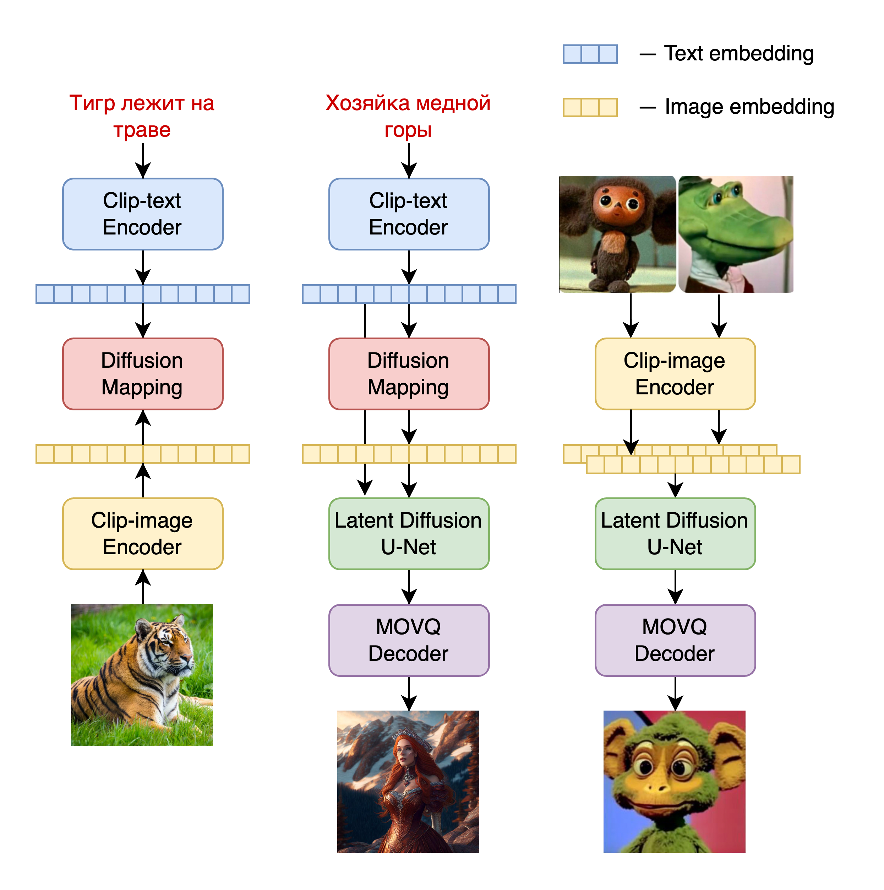
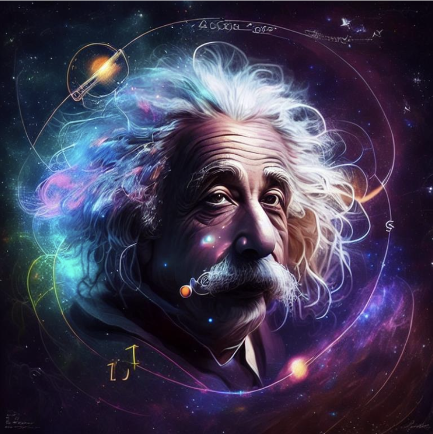
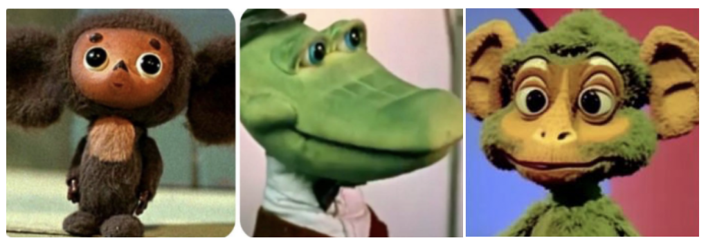
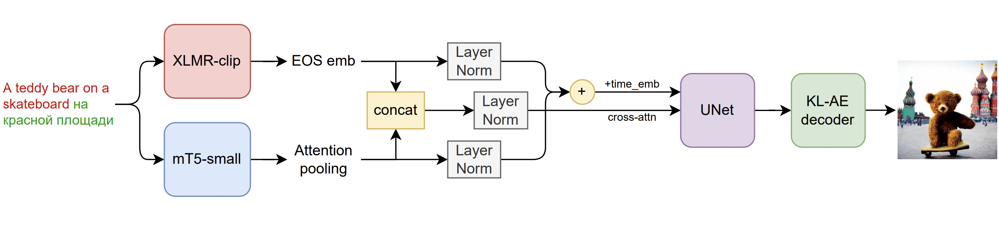
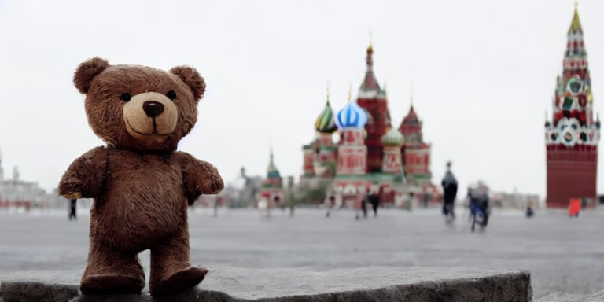
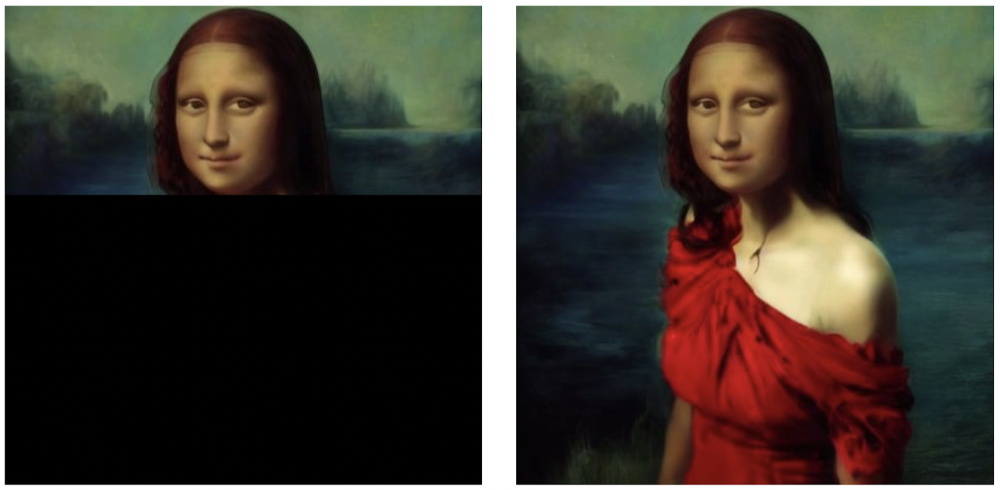

# Kandinsky 2.1

[](https://pytorch.org/) [](https://huggingface.co/sberbank-ai/Kandinsky_2.1)
[](https://colab.research.google.com/drive/1xSbu-b-EwYd6GdaFPRVgvXBX_mciZ41e?usp=sharing)


[Habr post](https://habr.com/ru/company/sberbank/blog/725282/)

[Demo](https://fusionbrain.ai/diffusion)

`pip install "git+https://github.com/ai-forever/Kandinsky-2.git"`

## Model architecture:



Kandinsky 2.1 inherits best practicies from Dall-E 2 and Latent diffusion, while introducing some new ideas.

As text and image encoder it uses CLIP model and diffusion image prior (mapping) between latent spaces of CLIP modalities. This approach increases the visual performance of the model and unveils new horizons in blending images and text-guided image manipulation.

For diffusion mapping of latent spaces we use transformer with num_layers=20, num_heads=32 and hidden_size=2048.

**Other architecture parts:**

+ Text encoder (XLM-Roberta-Large-Vit-L-14) - 560M
+ Diffusion Image Prior — 1B
+ CLIP image encoder (ViT-L/14) - 427M
+ Latent Diffusion U-Net - 1.22B
+ MoVQ encoder/decoder - 67M


Kandinsky 2.1 was trained on a large-scale image-text dataset LAION HighRes and fine-tuned on our internal datasets.


## How to use:

 Check our jupyter notebooks with examples in `./notebooks` folder


### 1. text2image

```python
from kandinsky2 import get_kandinsky2
model = get_kandinsky2('cuda', task_type='text2img', model_version='2.1', use_flash_attention=False)
images = model.generate_text2img(
    "red cat, 4k photo", 
    num_steps=100,
    batch_size=1, 
    guidance_scale=4,
    h=768, w=768,
    sampler='p_sampler', 
    prior_cf_scale=4,
    prior_steps="5"
)
```



prompt: "Einstein in space around the logarithm scheme"

### 2. image fuse

```python
from kandinsky2 import get_kandinsky2
from PIL import Image
model = get_kandinsky2('cuda', task_type='text2img', model_version='2.1', use_flash_attention=False)
images_texts = ['red cat', Image.open('img1.jpg'), Image.open('img2.jpg'), 'a man']
weights = [0.25, 0.25, 0.25, 0.25]
images = model.mix_images(
    images_texts, 
    weights, 
    num_steps=150,
    batch_size=1, 
    guidance_scale=5,
    h=768, w=768,
    sampler='p_sampler', 
    prior_cf_scale=4,
    prior_steps="5"
)
```



### 3. inpainting

```python
from kandinsky2 import get_kandinsky2
from PIL import Image
import numpy as np

model = get_kandinsky2('cuda', task_type='inpainting', model_version='2.1', use_flash_attention=False)
init_image = Image.open('img.jpg')
mask = np.ones((768, 768), dtype=np.float32)
mask[:,:550] =  0
images = model.generate_inpainting(
    'man 4k photo', 
    init_image, 
    mask, 
    num_steps=150,
    batch_size=1, 
    guidance_scale=5,
    h=768, w=768,
    sampler='p_sampler', 
    prior_cf_scale=4,
    prior_steps="5"
)
```


# Kandinsky 2.0

[](https://pytorch.org/) [](https://huggingface.co/sberbank-ai/Kandinsky_2.0) 
[](https://colab.research.google.com/drive/1uPg9KwGZ2hJBl9taGA_3kyKGw12Rh3ij?usp=sharing)

[Habr post](https://habr.com/ru/company/sberbank/blog/701162/)

[Demo](https://fusionbrain.ai/diffusion)

`pip install "git+https://github.com/ai-forever/Kandinsky-2.git"`


## Model architecture:

It is a latent diffusion model with two multilingual text encoders:
* mCLIP-XLMR 560M parameters
* mT5-encoder-small 146M parameters

These encoders and multilingual training datasets unveil the real multilingual text-to-image generation experience!

**Kandinsky 2.0** was trained on a large 1B multilingual set, including samples that we used to train Kandinsky.

In terms of diffusion architecture Kandinsky 2.0 implements UNet with 1.2B parameters.

**Kandinsky 2.0** architecture overview:



## How to use:
 
 Check our jupyter notebooks with examples in `./notebooks` folder
 
### 1. text2img

```python
from kandinsky2 import get_kandinsky2

model = get_kandinsky2('cuda', task_type='text2img')
images = model.generate_text2img('A teddy bear на красной площади', batch_size=4, h=512, w=512, num_steps=75, denoised_type='dynamic_threshold', dynamic_threshold_v=99.5, sampler='ddim_sampler', ddim_eta=0.05, guidance_scale=10)
```


prompt: "A teddy bear на красной площади"

### 2. inpainting
```python 
from kandinsky2 import get_kandinsky2
from PIL import Image
import numpy as np

model = get_kandinsky2('cuda', task_type='inpainting')
init_image = Image.open('image.jpg')
mask = np.ones((512, 512), dtype=np.float32)
mask[100:] =  0
images = model.generate_inpainting('Девушка в красном платье', init_image, mask, num_steps=50, denoised_type='dynamic_threshold', dynamic_threshold_v=99.5, sampler='ddim_sampler', ddim_eta=0.05, guidance_scale=10)
```



prompt: "Девушка в красном платье"

### 3. img2img
```python
from kandinsky2 import get_kandinsky2
from PIL import Image

model = get_kandinsky2('cuda', task_type='img2img')
init_image = Image.open('image.jpg')
images = model.generate_img2img('кошка', init_image, strength=0.8, num_steps=50, denoised_type='dynamic_threshold', dynamic_threshold_v=99.5, sampler='ddim_sampler', ddim_eta=0.05, guidance_scale=10)
```

# Authors

+ Arseniy Shakhmatov: [Github](https://github.com/cene555), [Blog](https://t.me/gradientdip)
+ Anton Razzhigaev: [Github](https://github.com/razzant), [Blog](https://t.me/abstractDL)
+ Aleksandr Nikolich: [Github](https://github.com/AlexWortega), [Blog](https://t.me/lovedeathtransformers)
+ Vladimir Arkhipkin: [Github](https://github.com/oriBetelgeuse)
+ Igor Pavlov: [Github](https://github.com/boomb0om)
+ Andrey Kuznetsov: [Github](https://github.com/kuznetsoffandrey)
+ Denis Dimitrov: [Github](https://github.com/denndimitrov)
